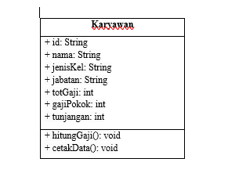
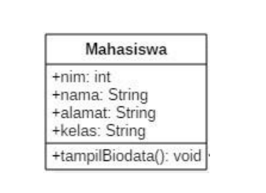
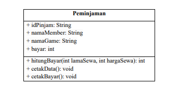
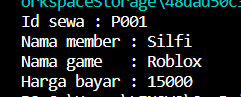
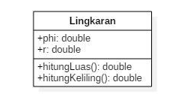
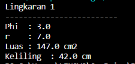
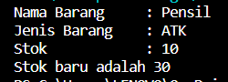

# Laporan Pertemuan 02

NIM  : 2241720054

Nama : Silfi Nazarina

Kelas : TI-2C

## Percobaan 1: Membuat Class Diagram

Studi Kasus 1:
Dalam suatu perusahaan salah satu data yang diolah adalah data karyawan. 
Setiap karyawan memiliki id, nama, jenis kelamin, jabatan, jabatan, dan 
gaji. Setiap mahasiswa juga bisa menampilkan data diri pribadi dan melihat 
gajinya.

1. Gambarkan desain class diagram dari studi kasus 1!

    

2. Sebutkan Class apa saja yang bisa dibuat dari studi kasus 1!

   **Jawab** : 2 Class yaitu class Karyawan dan class main

3. Sebutkan atribut beserta tipe datanya yang dapat diidentifikasi dari masing-masing class dari studi kasus 1!

   **Jawab**: String Id, String nama, String jenisKel, String jabatan, int totGaji, int gajiPokok, int tunjangan.

4. Sebutkan method-method yang sudah anda buat dari masing-masing 
class pada studi kasus 1!

   **Jawab**: 
   * hitungGaji() : void
   * cetakData() : void


## Percobaan 2: Membuat Class Diagram
**No 1-6 adalah tahapan percobaan**

Studi Kasus 2:
Perhatikan class diagram dibawah ini. Buatlah program berdasarkan class diagram tersebut!

   

u. Jelaskan pada bagian mana proses pendeklarasian atribut pada program diatas!

   **Jawab**: Dilakukan pada class Mahasiswa baris kode program setelah deklarasi class seperti berikut ini:
   ```java
   public class Mahasiswa {
      public int nim;
      public String nama;
      public String alamat;
      public String kelas;
   }
   ```
8. Jelaskan pada bagian mana proses pendeklarasian method pada program diatas!

   **Jawab**: Dideklarasikan setelah pendeklarasiana atribut di dalam class Mahasiswa seperti berikut:
   ```java
   public void tampilBiodata(){
        System.out.println("Nim    : "+ nim);
        System.out.println("Nama   : "+ nama);
        System.out.println("Alamat : "+ alamat);
        System.out.println("Kelas  : "+ kelas );
    }
   ```
9. Berapa banyak objek yang di instansiasi pada program diatas!

   **Jawab**: hanya satu yaitu mhs1 saja
10. Apakah yang sebenarnya dilakukan pada sintaks program “mhs1.nim=101” ?

   **Jawab**:  proses dalam kode tersebut adalah proses saat mengeset nilai nim pada objek mhs1 dengan nilai 101.

11. Apakah yang sebenarnya dilakukan pada sintaks program “mhs1.tampilBiodata()” ?

    **Jawab**: kode program tersebut digunakan untuk memanggil dan menjalankan method tampilBiodata() pada objek mhs1

12. Instansiasi 2 objek lagi pada program diatas!

    **Jawab**: 
    ```java
    Mahasiswa mhs2 = new Mahasiswa();
    Mahasiswa mhs3 = new Mahasiswa();
    ```


## Percobaan 3: Menulis method yang memiliki argument/parameter dan memiliki return
   **1-6 adalah tahapan percobaan**

7.	Apakah fungsi argumen dalam suatu method?

    **Jawab**: untuk mengisi atau mengirimkan data yang nantinya akan digunakan dalam menjalankan suatu method 

8.	Ambil kesimpulan tentang kegunaan dari kata kunci return , dan kapan suatu method harus memiliki return!  

    **Jawab**: return digunakan saat menggunakan method yang akan mengembalikan nilai. Digunakannya pada method dengan tipe data selaain void yang membutuhkan nilai kembalian. 

## TUGAS
1. Suatu toko persewaan video game salah satu yang diolah adalah peminjaman, dimana data yang dicatat ketika ada orang yang melakukan peminjaman adalah id, nama member, nama game, dan harga yang harus dibayar. Setiap peminjaman bisa menampilkan data hasil peminjaman dan harga yang harus dibayar. Buatlah class diagram pada studi kasus diatas!

   Penjelasan:

   •	Harga yang harus dibayar diperoleh dari lama sewa x harga.

   •	Diasumsikan 1x transaksi peminjaman game yang dipinjam hanya 1 game saja.
**Class Diagram:**

   

2.	Buatlah program dari class diagram yang sudah anda buat di no 1!

    **Jawab**: Jawaban ada pada class **Peminjaman.java** dengan main classnya pada class **TestPeminjaman.java** pada folder java yang sudah saya kumpulkan, dengan output:

    

3. Buatlah program sesuai dengan class diagram berikut ini:

   

   **Jawab**: Jawaban ada pada class **Lingkaran.java** dengan main classnya pada class **TestLingkaran.java** pada folder java yang sudah saya kumpulkan, dengan output:

   

4. Buatlah program sesuai dengan class diagram berikut ini:

   Deskripsi / Penjelasan :

   •	Nilai atribut hargaDasar dalam Rupiah dan atribut diskon dalam %

   •	Method hitungHargaJual() digunakan untuk menghitung harga jual dengan perhitungan berikut ini:
harga jual = harga dasar – (diskon x harga dasar)
 
   •	Method tampilData() digunakan untuk menampilkan nilai dari kode, namaBarang, hargaDasar, diskon dan harga jual.

   **Jawab**: Jawaban ada pada class **Barang.java** dengan main class nya pada **TestBarang.java** pada folder java yang sudah saya kumpulkan, dengan output:

   


