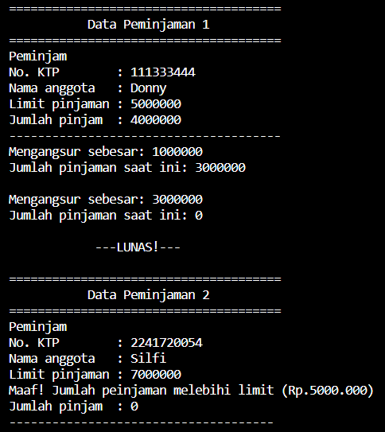
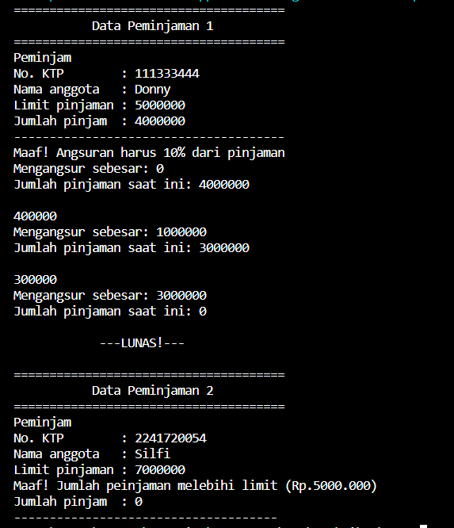

# Laporan Pertemuan 02

NIM  : 2241720054

Nama : Silfi Nazarina

Kelas : TI-2C

## Pertanyaan Percobaan 2 (Access Modifier)

1. Pada class TestMobil, saat kita menambah kecepatan untuk pertama kalinya, mengapa muncul peringatan “Kecepatan tidak bisa bertambah karena Mesin Off!”? 

    **Jawab**: Karena pada method tambahKecepatan() syarat untuk menambah kecepatan yaitu status kontak harus On. Sedangkan pada main mesin belum di nyalakan atau belum ada pemanggilan method nyalakanMesin() untuk mengubah status kontak menjadi On.

2. Mengapat atribut kecepatan dan kontakOn diset private? 

    **Jawab**: untuk mengontrol akses atribut motor juga untuk melindungi data dari akses langsung dari luar kelas, dan kita menggunakan metode untuk berinteraksi dengan data tersebut sesuai dengan aturan yang telah ditentukan oleh kelas itu sendiri. Ini berarti bahwa informasi ini hanya dapat diakses dan diubah oleh kelas Motor itu sendiri, bukan oleh kelas lain di luar sana.
Dengan cara ini, kelas Motor dapat memeriksa dan mengontrol bagaimana nilai-nilai ini digunakan, memberikan tingkat keamanan dan validasi yang lebih baik.


3. Ubah class Motor sehingga kecepatan maksimalnya adalah 100!

    **Jawab**: 
    Perubahan m=pada method tambahKecepatan() pada class Motor.java
    
    ```java
    public void tambahkecepatan(){
        if (kontakOn == true) {
            if (kecepatan>=100) {
                System.out.println("Anda telah memasuki kecepatan maksimal (100) \n");
                kecepatan = 100;
            } else {
                kecepatan += 20; //untuk menjawab pertanyaan no.3 saya mengubah kecepatan dari yang awalnya 5 menjadi 20
            }
        } else {
            System.out.println("Kecepatan tidak bisa bertambah karena mesin off! \n");
        }
    }
    ```

    Dan pemanggilan beberapa method pada class MotorDemo.java
    ```java
    package motorencapsulation;
    public class MotorDemo {
    public static void main(String[] args) {
        Motor motor = new Motor();
        motor.printStatus();
        motor.tambahkecepatan();

        motor.nyalakanMesin();
        motor.printStatus();

        motor.tambahkecepatan();
        motor.printStatus();

        motor.tambahkecepatan();
        motor.printStatus();

        motor.tambahkecepatan();
        motor.printStatus();

        motor.tambahkecepatan();
        motor.printStatus();

        motor.tambahkecepatan(); //nilai maksimal disini
        motor.printStatus();

        motor.tambahkecepatan(); //tidak bisa menambah lagi karena sudah sampai pada titik maksimal

        motor.kurangiKecepatan();
        motor.printStatus();

        motor.matikanMesin();
        motor.printStatus();
        }
    }
    ```

    dengan **Output** seperti berikut: 

     

## Pertanyaan Percobaan 3 dan 4 (konstruktor, getter dan setter)

1. Apa yang dimaksud getter dan setter?

    **Jawab**: Getter adalah public method dan memiliki tipe data return, yang berfungsi untuk mendapatkan nilai dari atribut private. Sedangkan setter adalah public method yang tidak memliki tipe data return, yang berfungsi untuk memanipulasi nilai dari atribut private.

2. Apa kegunaan dari method getSimpanan()?

    **Jawab**: untuk mengambil (mengakses) nilai dari variabel simpanan dan mengembalikannya kepada pemanggil metode tersebut

3. Method apa yang digunakan untk menambah saldo?

    **Jawab**: method setor(float uang) dalam class Anggota

4. Apa yand dimaksud konstruktor?

    **Jawab**: konstruktor adalah sebuah metode khusus dalam sebuah kelas yang memiliki nama yang sama dengan nama kelasnya. Fungsinya adalah untuk menginisialisasi objek yang dibuat dari kelas tersebut dengan nilai-nilai awal.

5. Sebutkan aturan dalam membuat konstruktor?

    **Jawab**: Antara lain sebagai berikut:

    * Nama konstruktor harus sama dengan nama class
    * Selalu memiliki modifier access public
    * Konstruktor tidak memiliki tipe data method 
    * Tidak bisa memiliki return

6. Apakah boleh konstruktor bertipe private?

    **Jawab**: Boleh, tapi konstruktor tersebut hanya bisa diakses di class itu sendiri dan tidak bisa dipanggil di class lainnya

7. Kapan menggunakan parameter dengan passing parameter?

    **Jawab**: ketika kita ingin memberikan informasi khusus atau nilai awal kepada objek yang kita buat. Hal ini biasa dilakukan untuk atribut yang membutuhkan nilai yang spesifik. Jika tidak membutuhkan nilai spesifik dalam konstruktor tidak perlu parameter

8. Apa perbedaan atribut class dan instansiasi atribut?
    **Jawab**: Atribut kelas digunakan untuk informasi yang bersifat bersamaan di seluruh kelas, sedangkan atribut instansiasi digunakan untuk informasi yang berbeda antara objek-objek individu yang merupakan instance dari kelas tersebut.

9. Apa perbedaan class method dan instansiasi method?

    **Jawab**: 
    * Class Method: Metode kelas dipanggil pada kelas itu sendiri, tidak memerlukan objek spesifik, dan memiliki cakupan data yang terkait dengan kelas secara keseluruhan. Mereka biasanya digunakan untuk tugas yang bersifat umum atau berkaitan dengan kelas secara umum.

    * Instance Method: Metode instansiasi dipanggil pada objek individu, memerlukan objek yang valid, dan memiliki cakupan data yang terkait dengan objek tersebut. Mereka digunakan untuk tugas yang spesifik untuk objek, seperti mengakses atau mengubah atribut objek dan menjalankan operasi yang melibatkan objek tersebut.

## TUGAS
1.  Cobalah program dibawah ini(seperti pada jobsheet) dan tuliskan hasil outputnya!

    Class **EncapDemo.java**
    ```java
    package encap;

    public class EncapDemo {
        private String name;
        private int age;

        public String getName(){
            return name;
        }

        public void setName(String newName){
            name = newName;
        }

        public int getAge(){
            return age;
        }

        public void setAge(int newAge){
            if (newAge > 30) {
                age = 30;
            } else {
                age = newAge;            
            }
        }
    }
    ```
    **Class EncapTest.java**
    ```java
        package encap;

    public class EncapTest {
        public static void main(String[] args) {
            EncapDemo encap = new EncapDemo();
            encap.setName("James");
            encap.setAge(35);

            System.out.println("Name : "+ encap.getName());
            System.out.println("Age : "+ encap.getAge());
        }
    }
    ```
    **Output**

    

2.  Pada program diatas, pada class EncapTest kita mengeset age dengan nilai 35, namun pada 
saat ditampilkan ke layar nilainya 30, jelaskan mengapa.

    **Jawab**: Karena pada class EncapDemo dalam method setAge berparameter  memiliki syarat menggunkaan if/else dimana jika newAge sebagai parameter diisi dengan angka lebih dari 30, maka variabel age akan di set dengan nilai 30 sebagai nilai maksimalnya. Walaupun yang diinputkan sebenarnya 35. Jadinya akan ditampilkanlah nilai maksimalnya yaitu 30.

3. Ubah program diatas agar atribut age dapat diberi nilai maksimal 30 dan minimal 18.

    **Jawab**: modifikasi dilakukan pada method setAge() dalam class EncapDemo dan perubahan pada inputan parameter method set age pada class EncapTest.

    **Class EncapDemo.java method setAge()**
    ```java
    public void setAge(int newAge){
        if(newAge > 30) {
            age = 30;
        }else if(newAge < 18){
            age = 18; // nilai minimal umur
        }else {
            age = newAge;            
        }
    }
    ```
    **Class EncapTest.java**
    ```java
    package encap;

    public class EncapTest {
        public static void main(String[] args) {
            EncapDemo encap = new EncapDemo();
            encap.setName("James");
            encap.setAge(12); //modifikasi untuk pengecekan nilai minimal

            System.out.println("Name : "+ encap.getName());
            System.out.println("Age : "+ encap.getAge());

        }
    }
    ```
    **Output**:

    

4. Pada sebuah sistem informasi koperasi simpan pinjam, terdapat class Anggota yang memiliki 
atribut antara lain nomor KTP, nama, limit peminjaman, dan jumlah pinjaman. Anggota 
dapat meminjam uang dengan batas limit peminjaman yang ditentukan. Anggota juga dapat 
mengangsur pinjaman. Ketika Anggota tersebut mengangsur pinjaman, maka jumlah 
pinjaman akan berkurang sesuai dengan nominal yang diangsur. Buatlah class Anggota 
tersebut, berikan atribut, method dan konstruktor sesuai dengan kebutuhan. Uji dengan 
TestKoperasi berikut ini untuk memeriksa apakah class Anggota yang anda buat telah sesuai 
dengan yang diharapkan.

    **Jawab**: 
    **Class Anggota.java**

    ```java
    package koperasitugas;

    //Tugas no 4 & 5

    public class Anggota {
        private String ktp, nama;
        private int limit, pinjaman;

        Anggota(String ktp, String nama, int limit){ 
            this.ktp = ktp;
            this.nama = nama;
            this.limit = limit;
            this.pinjaman = 0;
        }

        public void setKtp(String ktp){
            this.ktp = ktp;
        }

        public void setNama(String nama){
            this.nama = nama;
        }

        public String getKtp(){
            return ktp;
        }

        public String getNama(){
            return nama;
        }

        public int getLimit(){
            return limit;
        }

        public void angsur(int uang){
            pinjaman -= uang;
            System.out.println("Mengangsur sebesar: "+ uang); 
            System.out.println("Jumlah pinjaman saat ini: "+ pinjaman);
            System.out.println();
            if (pinjaman == 0) {
                System.out.println("\t    ---LUNAS!---");
            } 
        }

        public void pinjam (int uang){
            if (uang > limit) {
                // pinjaman = 5000000;
                System.out.println("Maaf! Jumlah peinjaman melebihi limit (Rp.5000.000)");
            } else {
                pinjaman += uang;
            }
            System.out.println("Jumlah pinjam  : "+ pinjaman);
        }
    }
    ```
    **Class TestKoperasi.java**
    ```java
    package koperasitugas;

    //Tugas no 4 & 5

    public class TestKoperasi {
        public static void main(String[] args) {
            Anggota anggota1 = new Anggota("111333444", "Donny", 5000000);

            System.out.println("======================================");
            System.out.println("\t   Data Peminjaman 1");
            System.out.println("======================================");
            System.out.println("Peminjam");
            System.out.println("No. KTP        : "+ anggota1.getKtp());
            System.out.println("Nama anggota   : "+ anggota1.getNama());
            System.out.println("Limit pinjaman : "+ anggota1.getLimit());
            anggota1.pinjam(4000000); //pinjaman dibawah limit
            System.out.println("--------------------------------------");
            anggota1.angsur(1000000);
            anggota1.angsur(3000000);

            System.out.println();
            Anggota anggota2 = new Anggota("2241720054", "Silfi", 7000000);

            System.out.println("======================================");
            System.out.println("\t   Data Peminjaman 2");
            System.out.println("======================================");
            System.out.println("Peminjam");
            System.out.println("No. KTP        : "+ anggota2.getKtp());
            System.out.println("Nama anggota   : "+ anggota2.getNama());
            System.out.println("Limit pinjaman : "+ anggota2.getLimit());
            anggota2.pinjam(10000000); //melampaui limit
            System.out.println("-------------------------------------");
        }
    }
    ```
    **Output**:

    

5.  Modifikasi soal no. 4 agar nominal yang dapat diangsur minimal adalah 10% dari jumlah 
pinjaman saat ini. Jika mengangsur kurang dari itu, maka muncul peringatan “Maaf, 
angsuran harus 10% dari jumlah pinjaman”

    **Jawab**:  Modifikasi dilakukan pada method angsur() dalam class **Anggota.java** seperti berikut:
    ```java
    public void angsur(int uang){
        int minimAngsur = (int)(0.1 * pinjaman);
        if (uang > minimAngsur) {
            pinjaman -= uang;
            System.out.println(minimAngsur);
        } else {
            System.out.println("Maaf! Angsuran harus 10% dari pinjaman");
            uang = 0;
        }
        System.out.println("Mengangsur sebesar: "+ uang); 
        System.out.println("Jumlah pinjaman saat ini: "+ pinjaman);
        System.out.println();
        if (pinjaman == 0) {
            System.out.println("\t    ---LUNAS!---");
        } 
    }
    ```
    juga pada class **TestKoperasi.java**:
    ```java
    package koperasitugas;

    //Tugas no 4 & 5

    public class TestKoperasi {
        public static void main(String[] args) {
            Anggota anggota1 = new Anggota("111333444", "Donny", 5000000);

            System.out.println("======================================");
            System.out.println("\t   Data Peminjaman 1");
            System.out.println("======================================");
            System.out.println("Peminjam");
            System.out.println("No. KTP        : "+ anggota1.getKtp());
            System.out.println("Nama anggota   : "+ anggota1.getNama());
            System.out.println("Limit pinjaman : "+ anggota1.getLimit());
            anggota1.pinjam(4000000); //pinjaman dibawah limit
            System.out.println("--------------------------------------");
            anggota1.angsur(20000);// percobaan mengangsur dibawah 10% pinjaman
            anggota1.angsur(1000000);
            anggota1.angsur(3000000);

            System.out.println();
            Anggota anggota2 = new Anggota("2241720054", "Silfi", 7000000);

            System.out.println("======================================");
            System.out.println("\t   Data Peminjaman 2");
            System.out.println("======================================");
            System.out.println("Peminjam");
            System.out.println("No. KTP        : "+ anggota2.getKtp());
            System.out.println("Nama anggota   : "+ anggota2.getNama());
            System.out.println("Limit pinjaman : "+ anggota2.getLimit());
            anggota2.pinjam(10000000); //melampaui limit
            System.out.println("-------------------------------------");
    
        }
    }
    ```

    Dengan **Output**:

    

6. Modifikasi class TestKoperasi, agar jumlah pinjaman dan angsuran dapat menerima input 
dari console.

    **Jawab**: Saya melakukan sedikit perubahan juga pada class Anggota.java dan perubahan utama pada TestKoperasi.java

    **Anggota.java**

    ```java
    package koperasitugas;

    //Tugas no 4 & 5

    public class Anggota {
        private String ktp, nama;
        private int limit;
        public int pinjaman;

        Anggota(String ktp, String nama, int limit){ 
            this.ktp = ktp;
            this.nama = nama;
            this.limit = limit;
            this.pinjaman = 0;
        }

        public void setKtp(String ktp){
            this.ktp = ktp;
        }

        public void setNama(String nama){
            this.nama = nama;
        }

        public String getKtp(){
            return ktp;
        }

        public String getNama(){
            return nama;
        }

        public int getLimit(){
            return limit;
        }

        public void angsur(int uang){
            int minimAngsur = (int)(0.1 * pinjaman);
            if (uang > minimAngsur) {
                pinjaman -= uang;
            } else {
                System.out.println("Maaf! Angsuran harus 10% dari pinjaman");
                uang = 0;
            }
            System.out.println("Jumlah pinjaman saat ini: "+ pinjaman);
            System.out.println();
            if (pinjaman == 0) {
                System.out.println("\t    ---LUNAS!---");
            } 
        }

        public void pinjam (int uang){
            if (uang > limit) {
                // pinjaman = 5000000;
                System.out.println("Maaf! Jumlah peinjaman melebihi limit (Rp.5000.000)");
            } else {
                pinjaman += uang;
            }
            System.out.println("Jumlah pinjam  : "+ pinjaman);
        }
    }
    ```

    **class TestKoperasi.java**
    ```java
    package koperasitugas;

    import java.util.Scanner;

    //Tugas no 4 & 5

    public class TestKoperasi {
        public static void main(String[] args) {
            Scanner sc = new Scanner(System.in);

            Anggota anggota1 = new Anggota("111333444", "Donny", 5000000);

            System.out.println("======================================");
            System.out.println("\t   Data Peminjaman 1");
            System.out.println("======================================");
            System.out.println("Peminjam");
            System.out.println("No. KTP        : "+ anggota1.getKtp());
            System.out.println("Nama anggota   : "+ anggota1.getNama());
            System.out.println("Limit pinjaman : "+ anggota1.getLimit());
            System.out.print("Jumlah pinjam  : ");
            anggota1.pinjaman = sc.nextInt();
            System.out.println("--------------------------------------");
            System.out.print("Mengangsur sebesar: "); 
            int angsuran = sc.nextInt();
            anggota1.angsur(angsuran);
            System.out.println();

            System.out.print("Mengangsur sebesar: "); 
            angsuran = sc.nextInt();
            anggota1.angsur(angsuran);
            System.out.println();
            
            System.out.print("Mengangsur sebesar: "); 
            angsuran = sc.nextInt();
            anggota1.angsur(angsuran);
            System.out.println();
        }
    }
    ```

    Dengan **Output** sebagai berikut:

    