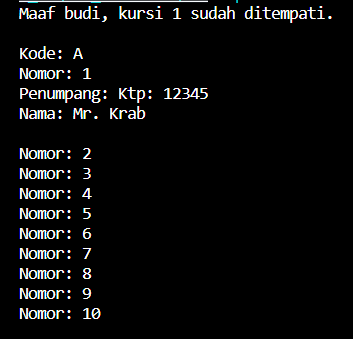

# Laporan Pertemuan 04

NIM  : 2241720054

Nama : Silfi Nazarina

Kelas : TI-2C

## Pertanyaan Percobaan 1 

1. Di dalam class Processor dan class Laptop , terdapat method setter dan getter untuk masing‑masing atributnya. Apakah gunanya method setter dan getter tersebut ?

    **Jawab:** Setter digunakan untuk , memanipulasi/me-set nilai dari atribut yang memiliki modifier private. Memungkinkan manipulasi data objek secara terkontrol dan memvalidasi data sebelum disimpan, jadi manipulasi ini tidak bisa dilakukan secara langsung kecuali pada kelas method setter.tersebut. Sedangkan getter adalah public method yang memiliki tipe data return, digunakan untuk mengambil nilai dari atribut yang memiliki akses modifier private. Memberikan akses mengambil ke data objek kepada pengguna luar tanpa mengizinkan mereka mengubah data tersebut secara langsung.

2. Di dalam class Processor dan class Laptop, masing‑masing terdapat konstruktor default dan konstruktor berparameter. Bagaimanakah beda penggunaan dari kedua jenis konstruktor tersebut ?

    **Jawab:** Pada konstruktor default tidak memerlukan parameter ataupun argumen dan digunakan untuk inisialisasi objek dengan nilai default mungkin null atau 0. Sedangkan konstruktor berparameter memerlukan parameter yang digunakan untuk menginisialisasi objek dengan nilai-nilai yang diberikan saat objek dibuat.

3. Perhatikan class Laptop, di antara 2 atribut yang dimiliki (merk dan proc), atribut manakah yang bertipe object ?

    **Jawab:** Atribut 'proc', karena tipe data yang digunakan bertipe 'Processor'.

4. Perhatikan class Laptop, pada baris manakah yang menunjukan bahwa class Laptop memiliki relasi dengan class Processor ?

    **Jawab:** Pada baris berikut:
    ```java
        private Processor proc;
    ```
    Pada baris tersebut, terdapat deklarasi atribut 'proc' dengan tipe' Processor', yang menunjukkan bahwa class Laptop memiliki sebuah objek dari class Processor sebagai bagian dari atributnya. Inilah yang menunjukkan bahwa class Laptop memiliki relasi dengan class Processor.

5. Perhatikan pada class Laptop , Apakah guna dari sintaks proc.info() ?

    **Jawab:** Untuk memanggil method info() dari objek 'proc' yang merupakan object dari class 'Processor'. Sehingga kita bisa mendapatkan informasi terkait merk processor dan cache yang ada, dari class 'Processor'.

6. Pada class MainPercobaan1, terdapat baris kode:
Laptop l = new Laptop("Thinkpad", p);. Apakah p tersebut ?
Dan apakah yang terjadi jika baris kode tersebut diubah menjadi: 

    ``` java
    Laptop l = new Laptop("Thinkpad", new Processor("Intel i5", 3)); 
    ```

    Bagaimanakah hasil program saat dijalankan, apakah ada perubahan?

    **Jawab:** Variabel p adalah objek dari class Processor yang telah dideklarasikan dan diinisialisasi sebelumnya. Pada kode tersebut, objek p berisi inisialisasi nilai merk: intel i5, cache:3. Kemudian objek p ini menjadi salah satu nilai inisialisasi pada objek L, yang berarti objek L saat ini memiliki 3 objek yaitu, merk laptop: Thinkpad, merk processor: intel i5, dan cache:3. Jika baris tersebut diganti seperti berikut:
    
    ```java
    Laptop L = new Laptop("Thinkpad", new Processor("Intel i5", 3));
    ```
    Output yang dihasilkan baris tersebut akan tetap sama yaitu:

    
    
    Bedanya, pada kode sebelumnya objek Processor (p) sudah dibuat sebelumnya menggunakan konstruktor berparameter. Sedangkan pada source code perubahan pada soal, objek Processor baru langsung idbuat didalam parameter objek Laptop (L) tanpa deklarasi objek Processor terlebih dahulu sebelumnya.

## Pertanyaan Percobaan 2

1. Perhatikan class Pelanggan. Pada baris program manakah yang menunjukan bahwa class Pelanggan memiliki relasi dengan class Mobil dan class Sopir ?

    **Jawab:** Pada baris:

    ```java
    private Mobil mobil;
    private Sopir sopir;
    ```
    Pada baris tersebut, instansiasi variabel pada class Pelanggan menggunkan tipe data objek kelas Mobil dan Sopir. Ini menunjukkan bahwa kelas Pelanggan memiliki relasi dengan kelas Mobil dan Sopir karena Pelanggan menggunakan objek dari kedua kelas tersebut. Dengan begitu, kelas Pelanggan dapat berinteraksi dengan dan mengakses properti dan metode yang didefinisikan dalam kelas Mobil dan Sopir.

2. Perhatikan method hitungBiayaSopir pada class Sopir, serta method hitungBiayaMobil pada class Mobil. Mengapa menurut Anda method tersebut harus memiliki argument hari ?

    **Jawab:** Karena dari kedua method ini nantinya akan digunakan untuk mebhitung total biaya yang harus dibayar selama mobil dan sopir ini disewa. Untuk menghitung berapa biaya sopir dan mobil yang digunakan, kita harus mengetahui berapa hari sopir dan mobil ini disewa. Maka dari itu parameter hari perlu digunakan.

3. Perhatikan kode dari class Pelanggan. Untuk apakah perintah mobil.hitungBiayaMobil(hari) dan sopir.hitungBiayaSopir(hari)?

    **Jawab:** Untuk memanggil method hitungBiayaMobil() yang ada di kelas Mobil dan hitungBiayaSopir() pada kelas Sopir. Kedua method ini nantinya akan mengembalikan nilai biaya yang sudah dikalikan berdasarkan hari yang diberikan. Dengan menggabungkan hasil dari kedua perhitungan ini, dapat diketahui biaya total yang harus dibayarkan oleh pelanggan untuk menyewa mobil dan sopir selama jumlah hari tertentu.

4. Perhatikan class MainPercobaan2. Untuk apakah sintaks p.setMobil(m) dan p.setSopir(s) ?

    **Jawab:** untuk memberikan nilai masukan pada objek Pelanggan (p) dan atribut Mobil, juga atribut Sopir yang digunakan pelanggan berupa objek m yang sebelumnya sudah diinisialisasi. Nilai yang tadi sudah diinisialisasi ini yang masuk ke objek p.

5. Perhatikan class MainPercobaan2. Untuk apakah proses p.hitungBiayaTotal() tersebut ?

   **Jawab:** Untuk menghitung total berapa uang yang harus dibayar oleh Pelanggan berdasarkan total biaya sewa mobil dan sopir. 

6. Perhatikan class MainPercobaan2, coba tambahkan pada baris terakhir dari method main dan amati perubahan saat di‑run! 

    ***System.out.println(p.getMobil().getMerk());*** 

    Jadi untuk apakah sintaks p.getMobil().getMerk() yang ada di dalam method main tersebut?

    **Jawab:** Output yang dihasilkan yaitu:

   

   sintaks tersebut digunakan untuk mendapatkan dan mencetak nilai atribut merk dalam atribut mobil yang bertipe data object Mobil pada class Pelanggan yang digunakan oleh pelanggan (p).

## Pertanyaan Percobaan 3

1. Di dalam method info() pada class KeretaApi, baris this.masinis.info() dan this.asisten.info() digunakan untuk apa ?

    **Jawab:** this.masinis.info() digunakan untuk memanggil method info() pada objek masinis yang merupakan objek dari kelas Pegawai. Dengan ini, method tersebut akan mengembalikan informasi yang ada pada kelas pegawai di objek masinis mencakup nip dan nama masinis. Sama halnya dengan this.asisten.info(). Informasi tentang nip dan nama asisten akan dikembalikan dari object asisten yang dimiliki kelas Pegawai.

2. Buatlah main program baru dengan nama class MainPertanyaan pada package yang sama. Tambahkan kode berikut pada method main() ! 

    ```java
    Pegawai masinis = new Pegawai("1234", "Spongebob Squarepants");
    KeretaApi keretaApi = new KeretaApi("Gaya Baru", "Bisnis", masinis); 
    System.out.println(keretaApi.info());
    ```

   **Jawab:** 
   ```java
    package percobaan3;

    public class MainPertanyaan {
        public static void main(String[] args) {
            Pegawai masinis = new Pegawai("1234", "Spongebob Squarepants");
            KeretaApi keretaApi = new KeretaApi("Gaya Baru", "Bisnis", masinis);

            System.out.println(keretaApi.info());
        }
    }
   ```

3. Apa hasil output dari main program tersebut ? Mengapa hal tersebut dapat terjadi ?

    **Jawab:** Hasilnya error dengan pesan seperti berikut:

    

    Karena pada kelas KeretaApi, konstruktornya memiliki 4 parameter yang masing masing berisi 1 nilai yang nantinya akan di panggil pada method info() untuk ditampilkan. Sedangkan pada kode error tersebut hanya diisi dengan 3 parameter yang otomatis pada method info() tidak bisa menampilkan sisa info jika ada salah satu yang kosong.

4. Perbaiki class KeretaApi sehingga program dapat berjalan !

    **Jawab:** 
    ```java
        package percobaan3;

        public class MainPertanyaan {
            public static void main(String[] args) {
                Pegawai masinis = new Pegawai("1234", "Spongebob Squarepants");
                Pegawai asisten = new Pegawai("4567", "Patrick Star");
                KeretaApi keretaApi = new KeretaApi("Gaya Baru", "Bisnis", masinis, asisten);

                System.out.println(keretaApi.info());
            }
        }   
    ```
    Dengan Output: <br>
    

## Pertanyaan Percobaan 4

1.  Pada main program dalam class MainPercobaan4, berapakah jumlah kursi dalam Gerbong A ?

    **Jawab:** ada 10 kursi.

2. Perhatikan potongan kode pada method info() dalam class Kursi. Apa maksud kode tersebut ?
    ```java
        ...
        if (this.penumpang != null) {
            info += "Penumpang: " + penumpang.info() + "\n";
        }
        ...
    ```

    **Jawab:** jika penumpang tidak sama dengan null /jika ada penumpang pada kursi tersebut, maka akan di cetak informasi Penumpang dengan menjalankan method info() dalam kelas Penumpang yang berisi ktp dan nama penumpang.

3. Mengapa pada method setPenumpang() dalam class Gerbong, nilai nomor dikurangi dengan angka 1 ?

    **Jawab:** karena indeks array dimulai dari angka 0, sedangkan nomor yang di set pada kelas Main, dimulai dari angka 1.

4. Instansiasi objek baru budi dengan tipe Penumpang, kemudian masukkan objek baru tersebut pada gerbong dengan gerbong setPenumpang(budi, 1). Apakah yang terjadi?

    **Jawab:** 
    ```java
        package percobaan4;

        public class MainPercobaan4 {
            public static void main(String[] args) {
                Penumpang p = new Penumpang("12345", "Mr. Krab");
                Gerbong gerbong = new Gerbong("A", 10);
                gerbong.setPenumpang(p, 1);

                //objek baru
                Penumpang budi = new Penumpang("67890", "budi");
                gerbong.setPenumpang(budi, 1);

                System.out.println(gerbong.info());
            }
        }
    ```
    Output:

    

    Sebelumnya, identitas penumpang pada kursi nomor 1 masih dimiliki oleh Mr. Krab, namun dengan adanya objek baru tersebut, budi menempati kursi nomomr 1 milik Mr.Krab.

5. Modifikasi program sehingga tidak diperkenankan untuk menduduki kursi yang sudah ada penumpang lain !

    **Jawab:** perubahan saya lakukan pada method setPenumpang() pada class Gerbong.java, yaitu:

    ```java
        public void setPenumpang(Penumpang penumpang, int nomor){ 
        Kursi kursi = this.arrayKursi[nomor-1];
        if (kursi.getPenumpang() == null) { 
            kursi.setPenumpang(penumpang);
        } else {
            System.out.println("Maaf "+ penumpang.getNama()+", kursi " + nomor + " sudah ditempati.");
            System.out.println();
        }
    }
    ```

    Dengan Output:

    

## TUGAS

Relasi class yang saya buat tentang peminjaman sebuah buku di perpustakaan dengan diagram sebagi berikut:


Berikut kodenya:

**Class Penulis:**
```java
    package Tugas;

    public class Penulis {

        private String nama;

        Penulis(String nama){
            this.nama = nama;
        }

        public void setNama(String nama) {
            this.nama = nama;
        }

        public String getNama() {
            return nama;
        }

        public void info(){
            System.out.println("Penulis       : "+ nama);
        }
    }
```

**Class Penerbit:**
```java
    package Tugas;

    public class Penerbit {
        private String nama, tahunTerbit;

        Penerbit(String nama, String tahunTerbit){
            this.nama = nama;
            this.tahunTerbit= tahunTerbit;
        }

        public void setNama(String nama) {
            this.nama = nama;
        }

        public String getNama() {
            return nama;
        }

        public void setTahunTerbit(String tahunTerbit) {
            this.tahunTerbit = tahunTerbit;
        }

        public String getTahunTerbit() {
            return tahunTerbit;
        }

        public void info(){
            System.out.println("Penerbit      : "+ nama);
            System.out.println("Tahun Terbit  : "+ tahunTerbit);
        }
    }
```

**Class Buku:**
```java
    package Tugas;

    public class Buku {
        private String judul, jenis;
        private Penulis penulis;
        private Penerbit penerbit;

        Buku(String judul, String jenis, Penulis penulis, Penerbit penerbit){
            this.judul = judul;
            this.jenis = jenis;
            this.penulis = penulis;
            this.penerbit = penerbit;
        }

        public void setJudul(String judul) {
            this.judul = judul;
        }

        public String getJudul() {
            return judul;
        }

        public void setJenis(String jenis) {
            this.jenis = jenis;
        }

        public String getJenis() {
            return jenis;
        }

        public void setPenulis(Penulis penulis) {
            this.penulis = penulis;
        }

        public Penulis getPenulis() {
            return penulis;
        }

        public void setPenerbit(Penerbit penerbit) {
            this.penerbit = penerbit;
        }

        public Penerbit getPenerbit() {
            return penerbit;
        }

        public void info(){
            System.out.println("Buku:" );
            System.out.println("Judul\t      : "+ judul);
            System.out.println("Jenis\t      : "+ jenis);
            penulis.info();
            penerbit.info();
            System.out.println("------------------------------------");
        }
    }
```

**Class Petugas:**
```java
    package Tugas;

    /**
     * Petugas
     */
    public class Petugas {
        private String idPetugas, nama;
        static int n=0;

        Petugas(String idPetugas, String nama){
            this.idPetugas = idPetugas;
            this.nama = nama;
        }

        public void setIdPetugas(String idPetugas) {
            this.idPetugas = idPetugas;
        }

        public String getIdPetugas() {
            return idPetugas;
        }

        public void setNama(String nama) {
            this.nama = nama;
        }

        public String getNama() {
            return nama;
        }

        public void info(){
            while (idPetugas != null) {
                System.out.println("\t--Peminjaman ke "+ (n+1)+ "--");
                n++;
                break;
            }
            System.out.println("Petugas:");
            System.out.println("Id Petugas    : "+ idPetugas);
            System.out.println("Nama Petugas  : "+ nama);
            System.out.println();
        }
    }
```

**Class Peminjam:**
```java
    package Tugas;

    public class Peminjam {
        private String idAnggota, nama;

        Peminjam(String idAnggota, String nama){
            this.idAnggota = idAnggota;
            this.nama = nama;
        }

        public void setIdAnggota(String idAnggota) {
            this.idAnggota = idAnggota;
        }

        public String getIdAnggota() {
            return idAnggota;
        }

        public void setNama(String nama) {
            this.nama = nama;
        }

        public String getNama() {
            return nama;
        }

        public void info(){
            System.out.println("Peminjam:");
            System.out.println("Id Anggota    : "+ idAnggota);
            System.out.println("Nama Peminjam : "+ nama);
            System.out.println();
        }
    }
```

**Class Peminjaman:**
```java
    package Tugas;

    public class Peminjaman {
        private Buku buku;
        private Peminjam peminjam;
        private Petugas petugas;

        Peminjaman(Buku buku, Peminjam peminjam, Petugas petugas){
            this.buku = buku;
            this.peminjam = peminjam;
            this.petugas = petugas;
        }

        public void setBuku(Buku buku) {
            this.buku = buku;
        }

        public Buku getBuku() {
            return buku;
        }

        public void setPeminjam(Peminjam peminjam) {
            this.peminjam = peminjam;
        }

        public Peminjam getPeminjam() {
            return peminjam;
        }

        public void setPetugas(Petugas petugas) {
            this.petugas = petugas;
        }

        public Petugas getPetugas() {
            return petugas;
        }

        public void info(){
            petugas.info();
            peminjam.info();
            buku.info();
        }
    }
```

**Class MainPeminjaman:**
```java
    package Tugas;

    public class MainPeminjaman {
        public static void main(String[] args) {
            System.out.println("====================================");
            System.out.println("   DATA PEMINJAMAN PERPUSTAKAAN");
            System.out.println("====================================");

            Penulis author1 = new Penulis("Andrea Hirata");
            Penerbit publisher1 = new Penerbit("Bentang Pustaka", "2005");
            Buku book1 = new Buku("Laskar Pelangi", "Novel", author1, publisher1);
            Peminjam pinjam1 = new Peminjam("A001", "Silfi Nazarina");
            Petugas bertugas1 = new Petugas("P001", "Diana");
            Peminjaman Log1 = new Peminjaman(book1, pinjam1, bertugas1);

            Log1.info();

            Penulis author2 = new Penulis("Gosho Aoyama");
            Penerbit publisher2 = new Penerbit("Shogakukan (TMS Entertaiment)", "1994");
            Buku book2 = new Buku("Detektif Conan", "Komik", author2, publisher2);
            Peminjam pinjam2 = new Peminjam("A002", "Doh Kyungsoo");
            Petugas bertugas2 = new Petugas("P001", "Diana");
            Peminjaman Log2 = new Peminjaman(book2, pinjam2, bertugas2);

            Log2.info();
        }
    }
```
Dengan **Output** seperti berikut:


