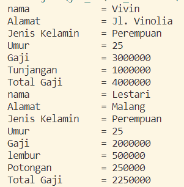
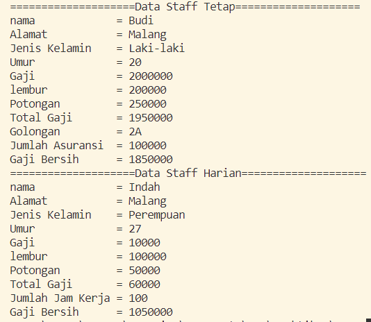
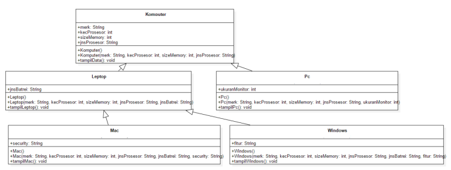
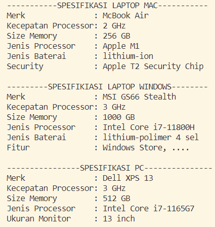

# Laporan Pertemuan 06 Inheritence(2)

NIM  : 2241720054

Nama : Silfi Nazarina

Kelas : TI-2C

##  Percobaan 1

**--Output:--**



**--Pertanyaan:--**

1.  Sebutkan class mana yang termasuk super class dan sub class dari percobaan 1 diatas! <br>

    **Jawab:** Class Karyawan yang menjadi superclass dan memiliki dua sub class yaitu Karyawan dan Manager

2. Kata kunci apakah yang digunakan untuk menurunkan suatu class ke class yang lain?

    **Jawab:** extends. Dengan struktur penulisan sebagai berikut:
    ```java
    public class nama_kelas extends nama_superclass{

    }
    ```
    yang pada konsep diatas, penggunaan keyword "extends" digunakan pada class Manager dan Staff sebagai sub class dari Karyawan.

3. Perhatikan kode program pada class Manager, atribut apa saja yang dimiliki oleh class tersebut? Sebutkan atribut mana saja yang diwarisi dari class Karyawan!

    **Jawab:** Atribut yang dimiliki oleh class Manager hanya tunjangan. Sedangkan atribut yang diwariskan dari Karyawan ke Manager adalah atribut gaji yang diakses menggunakan keyword "super.gaji" yang artinya memanggil/mengakses atribut gaji yang ada pada kelas superclass. Namun, jika terjadi pewarisan, semua atribut yang dimiliki oleh superclass dapat diwariskan ke subclassnya.

4. Jelaskan kata kunci super pada potongan program dibawah ini yang terdapat pada class Manager!
    ```java
    System.out.println("Total Gaji\t = "+ (super.gaji + tunjangan));
    ```
    **Jawab:** seperti yang sudah saya jelaskan pada soal no.3 bahwa penggunaan keyword super pada baris kode tersebut digunakan untuk mengakses atribut gaji pada superclass yang dimana superclassnya pada kasus ini adalah karyawan. Dengan pemanggilan/pengaksesan atribut gaji ini, class Manajer bisa menggunakannya untuk menghasilkan total gaji dengan menambahkannya dengan atribut tunjangan yang dimilikinya.

5.  Program pada percobaan 1 diatas termasuk dalam jenis inheritance apa? Jelaskan alasannya!

    **Jawab:** masuk kedalam jenis Hierarchical inheritance yang merupakan contoh pewarisan yang terjadi ketika sebuah kelas memiliki lebih dari satu kelas turunan (subclass) atau dengan kata lain, lebih dari satu kelas turunan memiliki kelas induk yang sama.

##  Percobaan 2

**--Output:--**



**--Pertanyaan:--**

1. Berdasarkan class diatas manakah yang termasuk single inheritance dan mana yang termasuk multilevel inheritance?

    **Jawab:** **Single inheritence** terjadi pada relasi class **Manager dengan Karyawan**, dimana Karyawan sebagai superclass dan Manager sebagai subclassnya. Dan **multilevel inheritence** terjadi pada relasi antara **StaffTetap -> Staff -> Karyawan**, dengan StaffTetap sebagai subclass dari Staff, dengan Staff sebagai superclass StaffTetap dan sebagai subclass dari Karyawan, kemudian Karyawan yang merupakan superclass dari Staff. Terjadi juga pada relasi antara **StaffHarian-> Staff -> Karyawan**, dengan StaffHarian sebagai subclass dari Staff, dengan Staff sebagai superclass StaffHarian dan sebagai subclass dari Karyawan, kemudian Karyawan yang merupakan superclass dari Staff.

2. Perhatikan kode program class StaffTetap dan StaffHarian, atribut apa saja yang  dimiliki oleh class tersebut? Sebutkan atribut mana saja yang diwarisi dari class Staff!

    **Jawab:** Jika terjadi pewarisan, semua atribut yang dimiliki oleh superclass dapat diwariskan ke subclassnya StaffTetap memiliki atribut berupa *golongan* dan *asuransi*, dengan atribut yang diwariskan dari Staff adalah atribut yang ada pada method *tampilDataStaff* yang isi atributnya antara lain lembur dan potongan ini akan digunakan pada method *tampilStaffTetap* dengan keyword **"super.tampildataStaff"** pada class StaffTetap. Constructor berparameter dari Staff juga diwariskan dalam class ini dengan keyword **"super(nama, alamat, jk, umur, gaji, lembur, potongan);"**. Dengan demikian semua atributnya terwariskan.

3. Apakah fungsi potongan program **super(nama, alamat, jk, umur, gaji, lembur, potongan);** pada class StaffHarian?

    **Jawab:** untuk memanggil konstruktor berparameter yang dimiliki superclassnya yaitu Staff. Dengan demikian, class StaffHarian dapat menggunakan konstruktor ini.

4. Apakah fungsi potongan program **super.tampilDataStaff** pada class StaffHarian?

    **Jawab:** untuk mengakses/menggunakan method tampilDataStaff yang dimiliki superclass yaitu class Staff. Dengan demikian kelas StaffHarian dapat menjalankan methood ini.

5. Terlihat dipotongan program pada class StaffTetap sebagai berikut: <br>
**System.out.println("Gaji Bersih      = "+ (gaji+lembur-potongan-asuransi));** <br>
atribut gaji, lembur dan potongan dapat diakses langsung. Kenapa hal ini bisa terjadi dan bagaimana class StaffTetap memiliki atribut gaji, lembur, dan potongan padahal dalam class tersebut tidak dideklarasikan atribut gaji, lembur, dan potongan?

    **Jawab:** Dalam class StaffTetap, atribut gaji, lembur, dan potongan dapat diakses langsung karena class StaffTetap adalah subclass dari class Staff. Ketika sebuah class adalah subclass dari class lain, maka class tersebut akan mewarisi semua atribut dan metode yang ada dalam superclassnya. Dalam hal ini, class StaffTetap mewarisi atribut gaji, lembur, dan potongan dari class Staff yang otomatis dapat digunakan dan diakses di kelas StaffTetap. Dapat disimpulkan jika terjadi pewarisan seluruh atribut superclass dapat diwariskan, tergantung apakah nantinya digunakan/dikases atau tidak di subclassnya.

## TUGAS

Buatlah sebuah program dengan konsep pewarisan seperti pada class diagram berikut ini. Kemudian buatlah instansiasi objek untuk menampilkan data pada class Mac, Windows dan Pc!.



**Jawab:**

Class **Komputer**.java:
```java
package Tugas;

public class Komputer {
    public String merk, jnsProsesor;
    public int kecProsesor, sizeMemory;

    Komputer(){

    }

    Komputer(String merk, int kecProsesor, int sizeMemory, String jnsProsesor){
        this.merk = merk;
        this.kecProsesor = kecProsesor;
        this.sizeMemory = sizeMemory;
        this.jnsProsesor = jnsProsesor;
    }

    public void tampilData(){
        System.out.println("Merk\t\t   : " + merk);
        System.out.println("Kecepatan Processor: "+ kecProsesor+ " GHz");
        System.out.println("Size Memory\t   : "+ sizeMemory+" GB");
        System.out.println("Jenis Processor    : "+ jnsProsesor);
    }
}
```

Class **Pc**.java:
```java
package Tugas;

public class Pc extends Komputer{
    public int ukuranMonitor;

    Pc(){

    }

    Pc(String merk, int kecProsesor, int sizeMemory, String jnsProsesor, int ukuranMonitor){
        super(merk, kecProsesor, sizeMemory, jnsProsesor);
        this.ukuranMonitor = ukuranMonitor;
    }

    public void tampilPc(){
        System.out.println("----------------SPESIFIKASI PC---------------");
        super.tampilData();
        System.out.println("Ukuran Monitor     : "+ ukuranMonitor+" inch");
    }
}
```

Class **Leptop**.java:
```java
package Tugas;

public class Leptop extends Komputer{
    public String jnsBatrei;

    Leptop(){

    }

    Leptop(String merk, int kecProsesor, int sizeMemory, String jnsProsesor, String jnsBatrei){
        super(merk, kecProsesor, sizeMemory, jnsProsesor);
        this.jnsBatrei = jnsBatrei;
    }

    public void tampilLeptop(){
        super.tampilData();
        System.out.println("Jenis Baterai      : "+ jnsBatrei);
    }
}
```

Class **Mac**.java:
```java
package Tugas;

public class Mac extends Leptop{
    public String security;

    Mac(){

    }

    Mac(String merk, int kecProsesor, int sizeMemory, String jnsProsesor, String jnsBatrei, String security){
        super(merk, kecProsesor, sizeMemory, jnsProsesor, jnsBatrei);
        this.security = security;
    }

    public void tampilMac(){
        System.out.println("-----------SPESIFIKASI LAPTOP MAC-----------");
        super.tampilLeptop();
        System.out.println("Security\t   : "+ security);
    }
}
```

Class **Windows**.java:
```java
package Tugas;

public class Windows extends Leptop{
    public String fitur;

    Windows(){

    }

    Windows(String merk, int kecProsesor, int sizeMemory, String jnsProsesor, String jnsBatrei, String fitur){
        super(merk, kecProsesor, sizeMemory, jnsProsesor, jnsBatrei);
        this.fitur = fitur;
    }

    public void tampilWindows(){
        System.out.println("---------SPESIFIKIASI LAPTOP WINDOWS--------");
        super.tampilLeptop();
        System.out.println("Fitur\t\t   : "+ fitur);
    }
}
```

Class **MainTugas**.java:
```java
package Tugas;

public class MainTugas {
    public static void main(String[] args) {
        Mac mc = new Mac("McBook Air", 2, 256 , "Apple M1", "lithium-ion", "Apple T2 Security Chip");
        mc.tampilMac();
        System.out.println();

        Windows wd = new Windows("MSI GS66 Stealth", 3, 1000, "Intel Core i7-11800H", "lithium-polimer 4 sel", "Windows Store, ....");
        wd.tampilWindows();
        System.out.println();

        Pc pc = new Pc("Dell XPS 13", 3, 512, "Intel Core i7-1165G7", (int)13.3);
        pc.tampilPc();
        System.out.println();
    }
}
//SILFI NAZARINA
```

Dengan **output** sebagai berikut:




