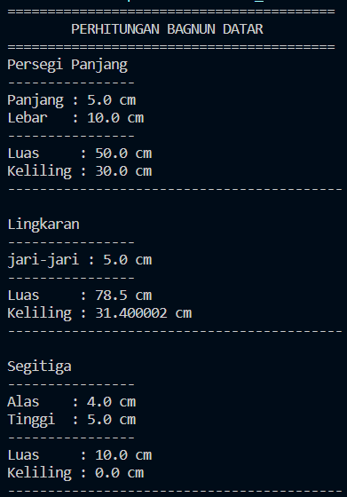
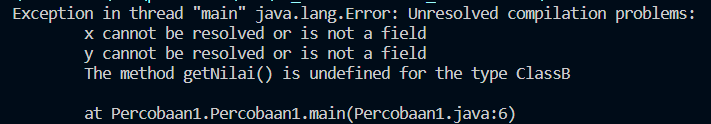
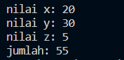
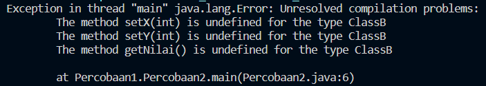
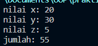
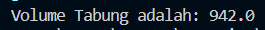
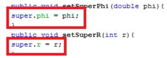
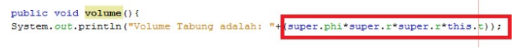
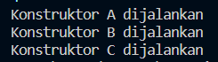
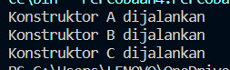

# Laporan Pertemuan 06

NIM  : 2241720054

Nama : Silfi Nazarina

Kelas : TI-2C

## Tugas Teori

Kode program ada pada folder TugasTeori dengan output seperti berikut:



## Percobaan 1

Hasil percobaan ini adalah error. seperti berikut:



**Pertanyaan:** </n>
1. Pada percobaan 1 diatas program yang dijalankan terjadi error, kemudian perbaiki sehingga program tersebut bisa dijalankan dan tidak error!
    **Jawab:** Perbaikan saya lakukan dengan menambahkan ***extends ClassA*** pada classB.java, yang artinya classB.java merupakan child dari ClassA.java, kode programnya seperti berikut:

    ```java
    package Percobaan1;

    public class ClassB extends ClassA{
        public int z;

        public void getNilaiZ(){
            System.out.println("nilai z: "+ z);
        }

        public void getJumlah(){
            System.out.println("jumlah: "+ (x+y+z));
        }
    }
    ```

    Dengan output:

    

2. Jelaskan apa penyebab program pada percobaan 1 ketika dijalankan terdapat error!

    **Jawab:** Error terjadi karena variabel x dan y tidak dapat diakses dalam ClassB. Pada metode getJumlah() di ClassB, kita mencoba mengakses variabel x dan y, tetapi variabel-variabel ini hanya dideklarasikan di ClassA. ClassB tidak memiliki akses langsung ke variabel x dan y. Oleh karena itu pesan error muncul pada line dan class tersebut. Dan solusi yang bisa dilakukan yaitu dengan merelasikan kedua class tersebut menggunakan metode inheritence (pewarisan);


## Percobaan 2

Percobaan ini menghasilkan pesan error seperti berikut:



**Pertanyaan:** </n>
1. Pada percobaan 2 diatas program yang dijalankan terjadi error, kemudian perbaiki sehingga program tersebut bisa dijalankan dan tidak error!

    **Jawab:** 

    ClassA.java 
    ```java
    package Percobaan1;

    public class ClassA {
        private int x, y;

        public void setX(int x) {
            this.x = x;
        }

        public void setY(int y) {
            this.y = y;
        }

        public int getX() {
            return x;
        }

        public int getY() {
            return y;
        }

        public void getNilai(){
            System.out.println("nilai x: "+ x);
            System.out.println("nilai y: "+ y);
        }
    }
    ```

    ClassB.java
    ```java
    package Percobaan1;

    public class ClassB extends ClassA {
        private int z;

        public void setZ(int z) {
            this.z = z;
        }

        public void getNilaiZ(){
            System.out.println("nilai z: "+ z);
        }

        public void getJumlah(){
            System.out.println("jumlah: "+ (getX() + getY() + z));
        }
    }
    ```

    Percobaan2.java
    ```java
    package Percobaan1;

    public class Percobaan2 {
        public static void main(String[] args) {
            ClassB hitung = new ClassB();
            hitung.setX(20);
            hitung.setY(30);
            hitung.setZ(5);
            hitung.getNilai();
            hitung.getNilaiZ();
            hitung.getJumlah();

        }
    }
    ```

    Output:

    

2. Jelaskan apa penyebab program pada percobaan 1 ketika dijalankan terdapat error!

    **Jawab:** Variabel x dan y dideklarasikan sebagai private dalam ClassA, sehingga tidak dapat diakses secara langsung oleh ClassB. Dengan demikian jika ingin mengaksesnya salah satu solusinya adalah dengan melakukan pewarisan oleh ClassA kepada Class dan melakukan pengaksesan variabel x dan y menggunakan method getter dan setter. Untuk pengakssesan yang dibutuhkan ClassB memerlukan akses untuk mengambil nilai, jadi yang digunakan adalah method getter yaitu getX() dan getY(). Seperti yang saya lakukan pada no.1


## Percobaan 3

Hasil dari percobaan ini adalah:



**Pertanyaan:**
1. Jelaskan fungsi “super” pada potongan program berikut di class Tabung!



    **Jawab:** digunakan untuk merujuk/megakses variabel phi dan r yang diwarisi dari kelas Bangun sebagai superclass. Dengan super.phi, nilai atribut phi di kelas Bangun dapat diatur dengan nilai yang diterima sebagai parameter phi dalam metode setSuperPhi di kelas Tabung. Begitu pula pada super.r dalam method setSuperR.

2. Jelaskan fungsi “super” dan “this” pada potongan program berikut di class Tabung!



    **Jawab:** Fungsi super dalam kode ini sama dengan soal pertama, yaitu digunakan untuk mengakses variabel phi dan r yang didefinisikan dalam superclass, sementara "this" digunakan untuk mengakses variabel yang merupakan bagian dari objek saat ini (kelas Tabung) yag pada kode ini merujuk pada ariabel t pada class Tabung.

3.  Jelaskan mengapa pada class Tabung tidak dideklarasikan atribut “phi” dan “r” tetapi class tersebut dapat mengakses atribut tersebut!

    **Jawab:** karena kelas Tabung adalah subclass dari Bangun, maka variabel "phi" dan "r" yang dideklarasikan dalam kelas Bangun dapat diakses oleh kelas Tabung dengan menggunakan tingkat akses "protected". Hal ini memungkinkan Tabung untuk menggunakan dan mengakses atribut "phi" dan "r" tanpa perlu mendeklarasikan ulang mereka dalam kelas Tabung. Karena, dengan menggunakan modifier protected, class yang sama, package yang sama dan subclass dapat melkukan pengaksesan pada variabel ini.

## Percobaan 4

Hasil dari percobaan ini adalah;



**Pertanyaan:** </n>
1. Pada percobaan 4 sebutkan mana class yang termasuk superclass dan subclass, kemudian jelaskan alasannya!

    **Jawab:** 
    * ClassA adalah superclass (kelas dasar).
    * ClassB adalah subclass dari ClassA (kelas anak ClassA).
    * ClassC adalah subclass dari ClassB (kelas anak ClassB dan secara tidak langsung merupakan anak ClassA).

    Alasannya adalah karena dalam pewarisan (inheritance), superclass adalah kelas yang memberikan atribut dan metode kepada subclass. ClassA adalah kelas paling atas dalam hierarki, sedangkan ClassB dan ClassC adalah turunan dari ClassA dan satu sama lain. Dengan demikian, ClassA adalah superclass dan ClassB serta ClassC adalah subclass. Dan dalam kode program digunakan keyword extends yang mengisyarakatkan bahwa relasi kelas ini inheritence.

2.  Ubahlah isi konstruktor default ClassC, Tambahkan kata super() di baris Pertaman dalam konstruktor defaultnya. Coba jalankan kembali class Percobaan4 dan terlihat tidak ada perbedaan dari hasil outputnya!

    **Jawab:** Hasilnya tetap sama:

    

3.  Ublah isi konstruktor default ClassC, Ketika mengubah posisi super() dibaris kedua dalam kontruktor defaultnya dan terlihat ada 
error. Kemudian kembalikan super() kebaris pertama seperti sebelumnya, maka errornya 
akan hilang. Perhatikan hasil keluaran ketika class Percobaan4 dijalankan. Kenapa bisa tampil output 
seperti berikut pada saat instansiasi objek test dari class ClassC!

    **jawab:** Karena konstruktor kelas bekerja dalam urutan berantai sesuai dengan hierarki pewarisan (inheritance) yang diprogramkan. Ketika objek test dari ClassC diinstansiasi, konstruktor ClassC akan dijalankan. Konstruktor ClassC kemudian secara otomatis memanggil konstruktor ClassB karena ClassB adalah superclass dari ClassC. Kemudian, konstruktor ClassB yang dijalankan juga secara otomatis memanggil konstruktor ClassA, karena ClassA adalah superclass dari ClassB. Setelah konstruktor ClassA selesai dijalankan, konstruktor ClassB melanjutkan dan menyelesaikan eksekusi. Dan, konstruktor ClassC menyelesaikan eksekusi setelah konstruktor ClassB selesai dijalankan.

4. Apakah fungsi super() pada ClassC?

    **Jawab:** Intinya, penggunaan super(); dalam konstruktor ClassC adalah untuk memanggil konstruktor kelas ClassB sebelum melanjutkan inisialisasi objek dari kelas ClassC.


## TUGAS


