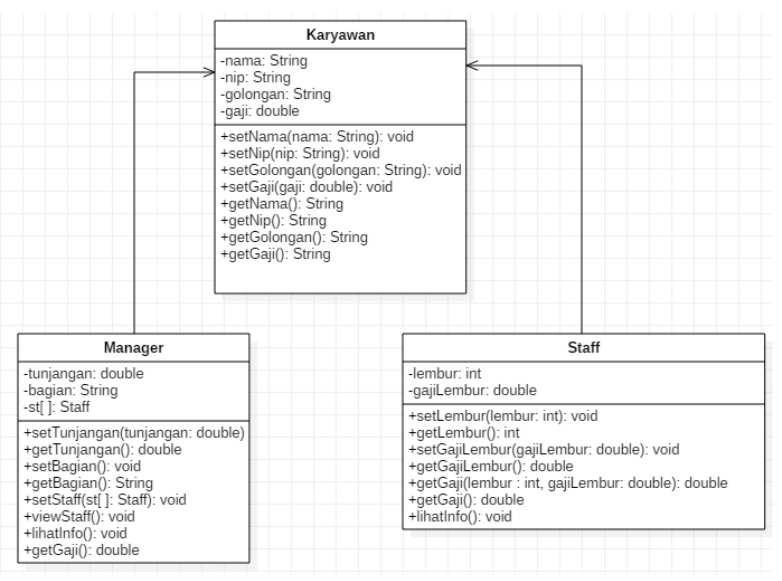
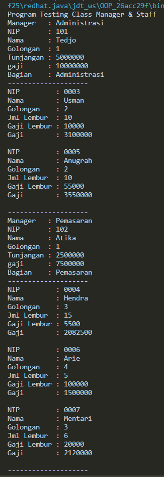
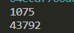
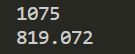
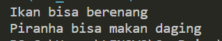
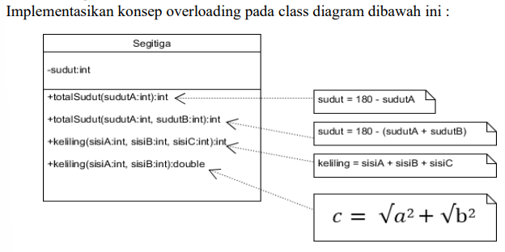
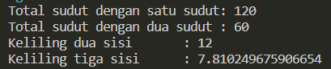
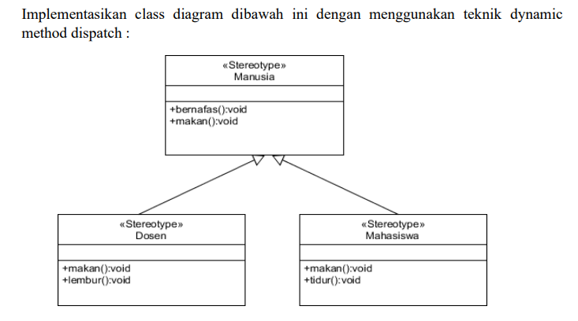
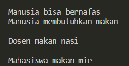

# Laporan Pertemuan 09 [Overloading-Overriding]

NIM  : 2241720054

Nama : Silfi Nazarina

Kelas : TI-2C

## Percobaan 1

Untuk kasus contoh berikut ini, terdapat tiga kelas, yaitu Karyawan, Manager, dan Staff. Class Karyawan merupakan superclass dari Manager dan Staff dimana subclass Manager dan Staff memiliki method untuk menghitung gaji yang berbeda.



**Jawab:** percobaan kode program pada percobaan ini sudah saya lakukan pada folder percobaan1 pada repository ini dengan output seperti berikut:



## Pertanyaan Latihan 

Percobaan source code, **Kode Program** latihan 1:

```java
public class PerkalianKu1 {
    void perkalian(int a, int b){
        System.out.println(a*b);
    }

    void perkalian(int a, int b, int c){
        System.out.println(a*b*c);
    }

    public static void main(String[] args) {
        PerkalianKu1 objek = new PerkalianKu1();

        objek.perkalian(25, 43);
        objek.perkalian(34, 23, 56);
    }
}
```

**Output:**



1. Dari source coding diatas terletak dimanakah overloading?

    **Jawab:** Overloading terletak pada method perkalian() pertama dan method perkalian() kedua. Kedua method tersebut memiliki nama yang sama (perkalian), namun memiliki jumlah parameter yang berbeda. Itulah yang disebut sebagai overloading, yaitu penggunaan nama metode yang sama tetapi dengan parameter yang berbeda.

2.  Jika terdapat overloading ada berapa jumlah parameter yang berbeda?

    **Jawab:** Dalam overloading source code diatas, method pertama memiliki parameter berjumlah 2 yaitu int a, int b. Sementara method kedua memiliki 3 isian parameter yaitu int a, int b dan int c.

Percobaan source code, **Kode Program** latihan 2:

```java
/**
 * PerkalianKu2
 */
//kode program latihan kedua
public class PerkalianKu2{
    void perkalian(int a, int b){
        System.out.println(a*b);
    }

    void perkalian(double a, double b){
        System.out.println(a*b);
    }

    public static void main(String[] args) {
        PerkalianKu2 objek = new PerkalianKu2();

        objek.perkalian(25, 43);
        objek.perkalian(34.56, 23.7);
    }
}
```

**Output:**



3. Dari source coding diatas terletak dimanakah overloading?

    **Jawab:** Sama seperti kode sebelumnya, overloading pada kode tersebut ada pada method perkalian yang pertama dan kedua.

4. Jika terdapat overloading ada berapa tipe parameter yang berbeda?

    **Jawab:** ada 2 jenis tipe data yang digunakan dalam parameter tersebut yakni pada pada method perkalian pertama parameter bertipe integer, sedangkan pada method perkalian kedua parameter bertipe double. 

Percobaan source code, **Kode Program** latihan 3:

```java
class Ikan {
    public void swim(){
        System.out.println("Ikan bisa berenang");
    }
}

class Piranha extends Ikan{
    public void swim(){
        System.out.println("Piranha bisa makan daging");
    }
}

public class Fish{
    public static void main(String[] args) {
        Ikan a = new Ikan();
        Ikan b = new Piranha();
        a.swim();
        b.swim();
    }
}
```

**Output:**



5. Dari source coding diatas terletak dimanakah overriding?

    **Jawab:** Terletak pada method swim() pada class Ikan yang diwariskan kepada class Piranha dengan method yang sama yaitu method swim().

6. Jabarkanlah apabila source coding diatas jika terdapat overriding?

    **Jawab:** Dalam code diatas, method swim di kelas Ikan mengoverride atau dalam artian mendefinisikan kembali atau mengimplementasikan ulang suatu method yang sudah ada di superclass kepada subclassnya yaitu Piranha. Dan Piranha sebagai subclass memiliki method yang sama dengan yang dimiliki oleh class induknya yaitu Ikan. Jadi, method swim pada kelas Ikan adalah metode yang akan di-override oleh metode di kelas Piranha. Di kelas Piranha, kita melihat overriding terjadi di sini. Metode swim di kelas Piranha memiliki implementasi yang berbeda dari metode swim di kelas Ikan. Ketika objek b yang merupakan instance dari Piranha memanggil metode swim, yang dieksekusi adalah implementasi dari kelas Piranha, bukan dari kelas Ikan. Sebaliknya, jika pada objek b diinstansiasi dari class Ikan dan memanggil method swim maka yang dieksekusi adalah implementasi method swim dari class Ikan. Hal ini menunjukkan konsep overriding dalam pewarisan (inheritance). 

# Tugas

1. 

**Jawab:** 

```java
public class Segitiga {
    private int sudut;
    
    public int totalSudut(int sudutA){
        return sudut = 180 - sudutA;
    }

    public int totalSudut(int sudutA, int sudutB){
        return sudut = 180 - (sudutA + sudutB);
    }

    public int keliling(int sisiA, int sisiB, int sisiC){
        return sisiA + sisiB + sisiC;
    }

    public double keliling(int sisiA, int sisiB){
        return Math.sqrt(Math.pow(sisiA, 2) + Math.pow(sisiB, 2));
    }

    public static void main(String[] args) {
        Segitiga st1 = new Segitiga();

        System.out.println("Total sudut dengan satu sudut: "+ st1.totalSudut(60));
        System.out.println("Total sudut dengan dua sudut : "+ st1.totalSudut(60, 60));
        System.out.println("Keliling dua sisi \t: "+ st1.keliling(3, 4 ,5));
        System.out.println("Keliling tiga sisi\t: "+ st1.keliling(5, 6));

    }
}
```

**Output:**



2. 

**Jawab:** 

**-Class Manusia.java-**
```java
public class Manusia {
    public void bernafas(){
        System.out.println("Manusia bisa bernafas");
    }

    public void makan(){
        System.out.println("Manusia membutuhkan makan");
    }
}
```

**-Class Dosen.java-**
```java
public class Dosen extends Manusia{
    public void makan(){
        System.out.println("Dosen makan nasi");
    }

    public void lembur(){
        System.out.println("Dosen bisa lembur");
    }
}
```

**-Class Mahasiswa.java-**
```java
public class Mahasiswa extends Manusia{
    public void makan(){
        System.out.println("Mahasiswa makan mie");
    }

    public void tidur(){
        System.out.println("Mahasiswa tertidur di kelas");
    }
}
```
**-Class Main.java-**
```java
public class Main {
    public static void main(String[] args) {
        Manusia hum1 = new Manusia();
        Manusia hum2 = new Dosen();
        Manusia hum3 = new Mahasiswa();

        hum1.bernafas();
        hum1.makan();
        System.out.println();
        hum2.makan();
        System.out.println();
        hum3.makan();
    }
}
```

**Output:**

