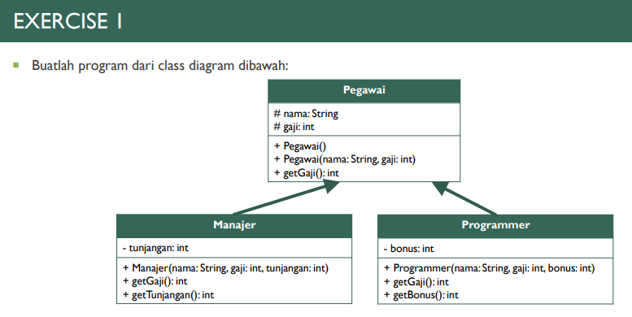
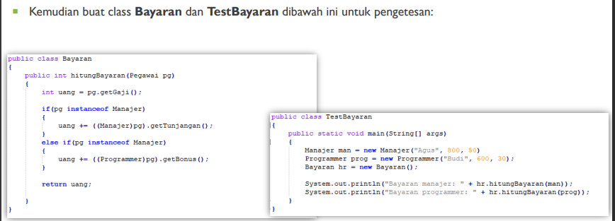
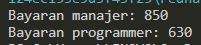
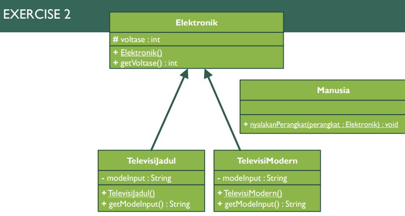
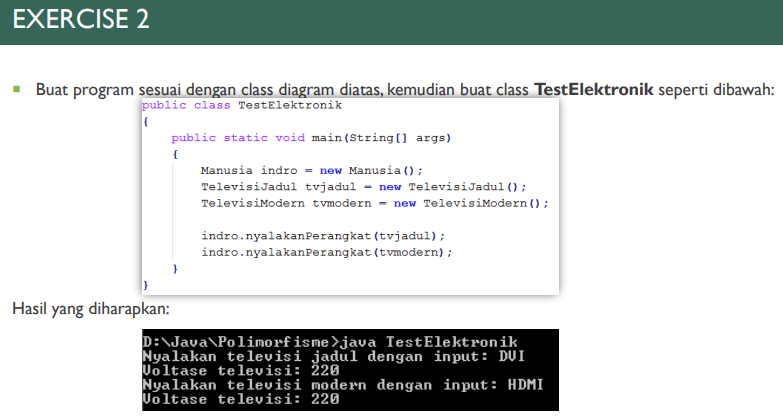
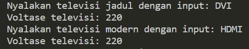

# Laporan Pertemuan 12 [Polymorphism]

NIM  : 2241720054

Nama : Silfi Nazarina

Kelas : TI-2C

## Exercise 1 Teori




**Jawab:** 

**-Class Pegawai.java-**
```java
/**
 * Pegawai
 */
public class Pegawai {
    protected String nama;
    protected int gaji;

    Pegawai(){

    }

    Pegawai(String nama, int gaji){
        this.nama = nama;
        this.gaji = gaji;
    }

    public int getGaji() {
        return gaji;
    }
}
```

**-Class Manajer.java-**
```java
public class Manajer extends Pegawai{
    private int tunjangan;

    Manajer(String nama, int gaji, int tunjangan){
        this.nama = nama;
        this.gaji = gaji;
        this.tunjangan = tunjangan;
    }

    @Override
    public int getGaji() {
        // TODO Auto-generated method stub
        return super.getGaji();
    }

    public int getTunjangan() {
        return tunjangan;
    }
}
```

**-Class Programmer.java-**
```java
public class Programmer extends Pegawai{
    private int bonus;

    Programmer(String nama, int gaji, int bonus){
        this.nama = nama;
        this.gaji = gaji;
        this.bonus = bonus;
    }

    @Override
    public int getGaji() {
        // TODO Auto-generated method stub
        return super.getGaji();
    }

    public int getBonus() {
        return bonus;
    }
}
```

**-Class Bayaran.java-**
```java
public class Bayaran {
    public int hitungBayaran(Pegawai pg){
        int uang = pg.getGaji();

        if (pg instanceof Manajer) {
            uang += ((Manajer)pg).getTunjangan();
        } else if (pg instanceof Programmer) {
            uang += ((Programmer)pg).getBonus();
        } 
        return uang;
    }
}
```

**-Class TestBayaran.java-**
```java
public class TestBayaran {
    public static void main(String[] args) {
        Manajer man = new Manajer("Agus", 800, 50);
        Programmer prog = new Programmer("Budi", 600, 30);
        Bayaran hr = new Bayaran();

        System.out.println("Bayaran manajer: "+ hr.hitungBayaran(man));
        System.out.println("Bayaran programmer: "+ hr.hitungBayaran(prog));
    }
}
```

**Output:**



## Exercise 2 Teori




**Jawab:**

**-Class Elektronik.java-**
```java
public class Elektronik {
    protected int voltase;

    Elektronik(){
        voltase = 220;
    }

    public int getVoltase() {
        return voltase;
    }
}
```

**-Class TelevisiJadul.java-**
```java
public class TelevisiJadul extends Elektronik{
    private String modeInput;

    TelevisiJadul(){
        modeInput = "DVI";
    }

    public String getModeInput() {
        return modeInput;
    }
}
```

**-Class TelevisiModern.java-**
```java
public class TelevisiModern extends Elektronik{
    private String modeInput;

    TelevisiModern(){
        modeInput = "HDMI";
    }

    public String getModeInput() {
        return modeInput;
    }
}
```

**-Class Manusia.java-**
```java
public class Manusia {
    public void nyalakanPerangkat(Elektronik perangkat){
        if (perangkat instanceof TelevisiJadul) {
            System.out.println("Nyalakan televisi jadul dengan input: " + ((TelevisiJadul)perangkat).getModeInput());
        } else if (perangkat instanceof TelevisiModern) {
            System.out.println("Nyalakan televisi modern dengan input: "+ ((TelevisiModern)perangkat).getModeInput());
        }
        System.out.println("Voltase televisi: "+ perangkat.getVoltase());
    }
}
```

**-Class TestElektronik.java-**
```java
public class TestElektronik {
    public static void main(String[] args) {
        Manusia indro = new Manusia();
        TelevisiJadul tvjadul = new TelevisiJadul();
        TelevisiModern tvmodern = new TelevisiModern();

        indro.nyalakanPerangkat(tvjadul);
        indro.nyalakanPerangkat(tvmodern);
    }
}
```

**Output:**



## Percobaan 1

Percobaan sudah saya lakukan pada folder 'percobaan' di repo ini. 

### Pertanyaan

1. Class apa sajakah yang merupakan turunan dari class Employee?

    **Jawab:** Class yang merupakan turunan dari 'Employee' adalah class 'InternshipEmployee' dan class 'PermanentEmployee'. 

2. Class apa sajakah yang implements ke interface Payable?

    **Jawab:** Class 'PermanentEmployee' dan class 'ElectricityBill'.

3. Perhatikan class Tester1, baris ke-10 dan 11. Mengapa e, bisa diisi dengan objek pEmp (merupakan objek dari class PermanentEmployee) dan objek iEmp (merupakan objek dari class
InternshipEmploye)?

    **Jawab:** Karena objek pEmp merepresentasikan class PermanentEmployee dan objek iEmp merepresentasikan class InternshipEmployee yang merupakan subclass dari class Employee yang dituliskan sebagai objek e

4. Perhatikan class Tester1, baris ke-12 dan 13. Mengapa p, bisa diisi dengan objekpEmp (merupakan objek dari class PermanentEmployee) dan objek eBill (merupakan objek dari class ElectricityBill)?

    **Jawab:** karena objek pEmp merepresentasikan class PermanentEmployee dan objek eBill merepresentasikan class ElectricityBill yang mana kedua class tersebut mengimplementasikan interface Payable.

5. Coba tambahkan sintaks: p = iEmp; e = eBill; pada baris 14 dan 15 (baris terakhir dalam method main) 

**Jawab:** 

**Output:**


    **! Apa yang menyebabkan error?** Terjadi error karena class InternshipEmployee tidak mengimplementasikan interface payable dan class ElectricityBill bukan subclass dari class Employee.

6. Ambil kesimpulan tentang konsep/bentuk dasar polimorfisme!

    **Jawab:** Konsep polimorfisme mengandalkan pewarisan (inheritance) dan implementasi antarmuka (interface) untuk memberikan fleksibilitas dalam penggunaan subclass atau class yang mengimplementasikan interface. Dengan polimorfisme, objek dari subclass atau class yang mengimplementasikan interface dapat dioperasikan melalui tipe atau interface yang sama, memungkinkan penggunaan yang adaptif dan seragam. Lebih lanjut, polimorfisme memungkinkan metode dalam subclass untuk melakukan override terhadap metode yang telah didefinisikan di superclass atau interface, memberikan kemampuan untuk mengatur perilaku yang berbeda untuk metode yang sama di kelas-kelas yang berbeda. Secara keseluruhan, konsep polimorfisme memungkinkan program untuk menangani objek dengan cara yang lebih abstrak dan fleksibel, meningkatkan keterbacaan dan modularitas kode.

## Percobaan 2

Percobaan sudah saya lakukan pada folder 'percobaan' pada class Tester2 dengan output:


### Pertanyaan

1. Perhatikan class Tester2 di atas, mengapa pemanggilan e.getEmployeeInfo() pada baris 8 dan pEmp.getEmployeeInfo() pada baris 10 menghasilkan hasil sama?

    **Jawab:** Pada program tersebut, terdapat dua objek yaitu pEmp dari kelas PermanentEmployee dan e dengan tipe referensi Employee. Namun, pada baris selanjutnya, e sekarang merujuk pada objek pEmp. Ketika e.getEmployeeInfo() pada baris selanjutnya, meskipun e dideklarasikan sebagai Employee, Java tahu bahwa objek sebenarnya yang sedang diakses adalah dari kelas PermanentEmployee. Jadi, meskipun tipe referensinya adalah Employee, metode yang dijalankan sebenarnya adalah metode dari kelas PermanentEmployee. Oleh karena itu, hasil dari e.getEmployeeInfo() dan pEmp.getEmployeeInfo() sama karena keduanya mengakses metode getEmployeeInfo() dari objek yang sama, yaitu objek pEmp yang merupakan objek dari kelas PermanentEmployee.

2.  Mengapa pemanggilan method e.getEmployeeInfo() disebut sebagai pemanggilan method virtual (virtual method invication), sedangkan pEmp.getEmployeeInfo() tidak?

    **Jawab:** Pada saat kompilasi, kompiler mengenali bahwa metode yang akan dipanggil adalah getEmployeeInfo() yang ada di kelas Employe, karena variabel e dideklarasikan dengan tipe Employee. Namun, saat program dijalankan, JVM sebenarnya menjalankan metode getEmployeeInfo() yang ada di kelas PermanentEmployee, bukan di kelas Employee. Pada baris pEmp.getEmployeeInfo(), metode getEmployeeInfo() yang dikenali oleh kompiler saat kompilasi dan yang dijalankan oleh JVM saat runtime adalah metode yang sama, yaitu getEmployeeInfo() yang ada di kelas PermanentEmployee. Ini terjadi karena objek pEmp dideklarasikan dari kelas PermanentEmployee.

3. Jadi apakah yang dimaksud dari virtual method invocation? Mengapa disebut virtual?

    **Jawab:** Virtual method invocation terjadi ketika terdapat polimorfisme dan overriding pada kode program. Virtual method invocation mengacu pada proses pemanggilan method pada saat runtime, di mana implementasi yang sebenarnya dari method tersebut ditentukan berdasarkan jenis objek yang sebenarnya saat aplikasi dijalankan.  Istilah "virtual" digunakan karena pada saat runtime, JVM (Java Virtual Machine) menentukan metode mana yang sebenarnya akan dijalankan berdasarkan objek aktual yang sedang dioperasikan, bukan berdasarkan tipe referensi variabel. Jadi, ketika kita mengatakan bahwa suatu metode adalah "virtual," itu berarti implementasi metode yang sebenarnya akan ditentukan pada saat runtime, dan JVM akan memastikan pemanggilan metode ini cocok dengan objek yang sebenarnya dioperasikan, memberikan fleksibilitas dan adaptabilitas dalam pemrograman berorientasi objek. 

## Percobaan 3

Percobaan sudah saya lakukan pada folder 'percobaan' pada file 'Tester3.java'

**Output:** 


### Pertanyaan

1. Perhatikan array e pada baris ke-8, mengapa ia bisa diisi dengan objek-objek dengan tipe yang berbeda, yaitu objek pEmp (objek dari PermanentEmployee) dan objek iEmp (objek dari InternshipEmployee) ?

   **Jawab:** Karena PermanentEmployee dan InternshipEmployee merupakan kelas turunan dari Employee, dan dalam konsep polimorfisme, objek yang berasal dari kelas turunan dapat dianggap sebagai objek dari kelas induknya. Oleh karena itu, array e[] dapat mengandung objek dari kelas-kelas turunan Employee, seperti pEmp dari PermanentEmployee dan iEmp dari InternshipEmployee.

2. Perhatikan juga baris ke-9, mengapa array p juga biisi dengan objek-objek dengan tipe yang berbeda, yaitu objek pEmp (objek dari PermanentEmployee) dan objek eBill (objek dari ElectricityBilling) 

   **Jawab:** Karena kedua class dari objek tersebut mengimplementasikan interface Payable.

3. Perhatikan baris ke-10 mengapa terjadi error?

   **Jawab:** Array e2[] hanya dapat menampung objek yang merupakan turunan dari kelas Employee. Namun, eBill adalah objek dari kelas ElectricityBill, bukan turunan dari kelas Employee, sehingga tidak dapat dimasukkan ke dalam array Employee[].

## Percobaan 4

Pada percobaan ini, kita diminta untuk membuat class baru dan melakukan percobaan seperti contoh. Class yang dibuat adalah class 'Owner' dan class 'tester4'. Semua percobaan ini telah saya lakukan dalam folder percobaan. Dengan memunculkan output seperti berikut ketika di run:


### Pertanyaan

1. Perhatikan class Tester4 baris ke-7 dan baris ke-11, mengapa pemanggilan ow.pay(eBill) dan ow.pay(pEmp) bisa dilakukan, padahal jika diperhatikan method pay() yang ada di dalam class Owner memiliki argument/parameter bertipe Payable? Jika diperhatikan lebih detil eBill merupakan objek dari ElectricityBill dan pEmp merupakan objek dari PermanentEmployee ?

    **Jawab:** Karena argument pada class Owner menerapkan konsep polimorphism. Karena itu method pada class ini bisa menerima nilai argument dari berbagai bentuk objek. Pada baris tersebut dipanggillah method pay pada objek ow yang dideklarasikan dari class Owner. Pada method pay memiliki paraneter atau argumen berupa p bertipe Payable, dimana Payable merupakan interface yang diterapkan/diimplementasikan dalam class PermanentEmployee dan ElectricalBill oleh karena itu, method pay dapat menerima argument berupa objek dari class class yang menerapkan interface tersebut.

2. Jadi apakah tujuan membuat argument bertipe Payable pada method 
pay() yang ada di dalam class Owner.

    **Jawab:** Agar method ini dapat menerima argument objek dari class class yang mengimplementasikan interface Payable.

3. Coba pada baris terakhir method main() yang ada di dalam class Tester4 ditambahkan perintah ow.pay(iEmp); Mengapa terjadi error?

   **Jawab**: Percobaan:

    ```java
    public class Tester4 {
        public static void main(String[] args) {
            Owner ow = new Owner();
            ElectricityBill eBill = new ElectricityBill(5, "R-1");
            ow.pay(eBill); //pay for Electricity bill
            System.out.println("--------------------------------------------");

            PermanentEmployee pEmp = new PermanentEmployee("Dedik", 500);
            ow.pay(pEmp); //pay for permanent employee
            System.out.println("--------------------------------------------");

            InternshipEmployee iEmp = new InternshipEmployee("Sunarto", 5);
            ow.showMyEmployee(pEmp); //show permanent employee info
            System.out.println("--------------------------------------------");
            ow.showMyEmployee(iEmp); //show internship employee info

            //pertanyaan no3 percobaan 4
            ow.pay(iEmp);
        }
    }
    ``` 

Output:


**Mengapa terjadi error?**

Terjadi error karena, class InternshipEmployee yang menjadi class dari objek iEmp tidak menerapkan/mengimplementasikan interface Payable.

4. Perhatikan class Owner, diperlukan untuk apakah sintaks p
instanceof ElectricityBill pada baris ke-6 ?

    **Jawab:** Digunakan untuk memeriksa apakah objek yang disimpan dalam variabel p adalah instance dari kelas ElectricityBill atau turunannya. Hasil dari instanceof berupa nilai boolean, jika if bernilai true maka sintaksnya akan dijalankan

5. Perhatikan kembali class Owner baris ke-7, untuk apakah casting objek disana (ElectricityBill eb = (ElectricityBill) p) diperlukan ? Mengapa objek p yang bertipe Payable harus di-casting ke dalam objek eb yang bertipe ElectricityBill ?

    **Jawab:** digunakan untuk mengubah tipe dari suatu objek. Pada kode program tersebut terjadi Downcast, yaitu suatu objek mengonversi referensi dari tipe yang lebih umum (Payable) menjadi tipe yang lebih spesifik yaitu ElectricityBill. Hal ini diperlukan karena dalam implementasi method pay(Payable p), parameter p dideklarasikan sebagai tipe Payable, yang merupakan tipe yang lebih umum.


## TUGAS


**Jawab:** 

**Interface Destroyable-**
```java
public interface Destroyabel {
    public void destroyed();
} 
```

**-Class Zombie-**
```java
public abstract class Zombie implements Destroyabel{
    protected int health, level;

    Zombie(int health, int level){
        this.health = health;
        this.level = level;
    }

    public abstract void heal();
    public abstract void destroyed();

    public String getZombieInfo(){
        return "Health : " + health + "\nLevel  : " + level + "\n";
    }
}

```

**-Class JumpingZombie-**
```java
public class JumpingZombie extends Zombie{
    JumpingZombie(int health, int level){
        super(health, level);
    }

    @Override
    public void heal() {
        switch (level) {
            case 1:
                health += (health * 0.3);
                break;
            case 2:
                health += (health * 0.4);
                break;
            case 3:
                health += (health * 0.5);
                break;
        }
    }

    @Override
    public void destroyed() {
        // health berkurang 1% setiap penghancuran
        health -= (health * 0.01);
    }

    @Override
    public String getZombieInfo() {
        // TODO Auto-generated method stub
        System.out.println("Jumping Zombie Data: ");
        return super.getZombieInfo();
    }
}
```

**-Class WalkingZombie-**
```java
public class WalkingZombie extends Zombie{
    WalkingZombie(int health, int level){
        super(health, level);
    }

    @Override
    public void heal() {
        switch (level) {
            case 1:
                health += (health * 0.1);
                break;
            case 2:
                health += (health * 0.3);
                break;
            case 3:
                health += (health * 0.4);
                break;
        }
    }

    @Override
    public void destroyed() {
        // health berkurang 2% setiap penghancuran
        health -= (health * 0.02);
    }

    @Override
    public String getZombieInfo() {
        // TODO Auto-generated method stub
        System.out.println("Walking Zombie Data: ");
        return super.getZombieInfo();
    }
}
```

**-Class Barrier-**
```java
public class Barrier implements Destroyabel{
    private int strength;

    Barrier(int strength){
        this.strength = strength;
    }

    public void setStrength(int strength) {
        this.strength = strength;
    }

    public int getStrength() {
        return strength;
    }

    @Override
    public void destroyed(){
        strength -= (strength * 0.1);
    }

    public String getBarrierInfo(){
        return "Barrier Strenght : "+ strength;
    }
}
```

**-Class Plant-**
```java
public class Plant {
    public void doDestroy(Destroyabel d){
        if (d instanceof WalkingZombie) {
            WalkingZombie wz = (WalkingZombie) d;
            wz.destroyed();
        } else if (d instanceof JumpingZombie) {
            JumpingZombie jz = (JumpingZombie) d;
            jz.destroyed();
        } else if (d instanceof Barrier) {
            Barrier b = (Barrier) d;
            b.destroyed();
        }
    }
}
```

**-Class Tester-**
```java
public class Tester {
    public static void main(String[] args) {
        WalkingZombie  wz = new WalkingZombie(100, 1);
        JumpingZombie jz = new JumpingZombie(100, 2);
        Barrier b = new Barrier(100);
        Plant p = new Plant();
        System.out.println(""+ wz.getZombieInfo());
        System.out.println(""+ jz.getZombieInfo());
        System.out.println(""+ b.getBarrierInfo());
        System.out.println("--------------------------");
        for (int i = 0; i < 4; i++) {
            p.doDestroy(wz);
            p.doDestroy(jz);
            p.doDestroy(b);
        }
        System.out.println(""+wz.getZombieInfo());
        System.out.println(""+jz.getZombieInfo());
        System.out.println(""+b.getBarrierInfo());
    }
}
```

**Output:**

