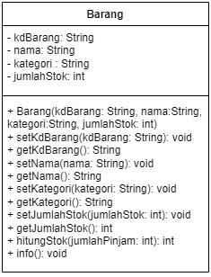
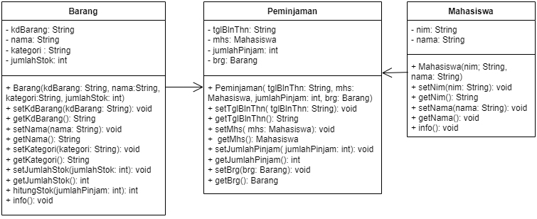

#   QUIZ 1

NIM  : 2241720054

Nama : Silfi Nazarina

Kelas : TI-2C


### 1.	Class dan Object:

* Apa yang dimaksud dengan "class" dalam pemrograman berorientasi objek?

    **Jawab:**  Class meruapakan sebuah blueprint/template dari objek yang mendefinisikan sejumlah atribut dan method yang dimiliki oleh objek.

* Bagaimana Anda mendefinisikan objek dari suatu class dalam bahasa pemrograman Java?

    **Jawab:** :Pertama, kita harus membuat sebuah class dahulu, kemudian untuk mendefinisikan objek dalam suatu class syntax yang digunakan seperti berikut :
    ```java
        namaclass namaobjek = new konstruktorclass();
    ```

* Misalkan Anda memiliki class "Barang" dalam sistem informasi inventaris. Bagaimana Anda akan membuat objek "laptop" dari class tersebut?

    **Jawab :**  Barang laptop = new Barang();

### 2.	Encapsulation:

* Jelaskan konsep encapsulation dalam pemrograman berorientasi objek dan mengapa hal ini penting dalam pengembangan sistem informasi inventaris barang. 

    **Jawab:** Enkapsulasi yaitu mengelompokkan pengaksesan suatu data dan method yang beroperasi ke dalam satu kelas. Dimaksudkan agar ada pembatasan dalam pengaksesan suati data yang tergolong penting, agar tidak sembarangan diakses. Jadi dapat dikatakan enkapsulasi menentukan pemberian hak akses pada tiap atribut dan metohd.


	*Mengapa penting?*<br>
    sebagai kontrol akses, keamanan data dan perubahan inetrnal kelas yang aman.

* Dalam konteks sistem informasi inventaris, sebutkan contoh atribut (variabel) yang harus di-encapsulate dan mengapa.

    **Jawab:** Mungkin salah satunya KodeBarang. Karena setiap kode memiliki keunikan tersendiri yang membuatnya berbeda dari kode kode lainnya dan kode biasa digunakan sebagai salah satu pengenal/identitas suatu barang. Sehingga jika terjadi perubahan yang tiba-tiba, kondisi data akan berantakan. Atau mungkin juga bisa harga barang, jumlah stok dan lain sebagainya.

### 3.	Relasi Kelas:

* Apa yang dimaksud dengan relasi antara kelas dalam pemrograman berorientasi objek?

    **Jawab:** Relasi antara kelas adalah interaksi yang terjadi antara dua atau lebih kelas yang berbeda dalam sebuah program. Dimana kelas-kelas yang berelasi ini harus memiliki hubungan atau kerkaitan yang kuat satu sama lain.

* Dalam sistem informasi inventaris barang, bagaimana Anda akan menggambarkan relasi antara kelas "Barang" dan kelas "Kategori"?

    **Jawab:**: Mungkin, nantinya kelas "Kategori bisa direlasikan dengan kelas "Barang", dengan membuat konstruktor pada kedua kelas ini yang masing-masing memiliki parameter. Pada kelas Barang, mungkin bisa diisi dengan parameter namaBarang, jumlahStok, dan sebagainya. Lalu, pada kelas "Kategori" diisi dengan parameter 'Barang', 'namaKategori". Sehingga nanti pada main, pendefinisian objek untuk kelas Barang harus didulukan misal: 
    ```java 
    Barang laptop = new Barang("Laptop", 5); 
    ```
    kemudian dilanjutkan dengan mendefinisikan objek pada kelas "Kategori" dengan memasukkan objek laptop tadi, sebagai input parameternya seperti: 
    ```java
    Kategori kategori1 = new Kategori(laptop, "Elektronik");
    ```
    Sehingga kedua kelas ini memeiliki relasi asosiasi karena bisa dibilang kelas Kategori meminjam objek Barang berupa laptop guna mengisi barangnya. Tidak lupa juga pada kelas Kategori juga harus di deklarasikan atribut untuk menyimpan nilai barang dengan tipe data "Barang".

#### 4.	PBL:
* Berdasarkan kasus sistem informasi inventaris barang, coba buat sebuah class sederhana beserta atribut dan metodenya yang menggambarkan suatu entitas dalam sistem tersebut (misalnya, class "Barang").

    **Jawab:**

    

    ```java
    /**
     * Barang
    */
    public class Barang {
        private String kdBarang, nama, kategori;
        private int jumlahStok;

        Barang(String kdBarang, String nama, String kategori, int jumlahStok){
            this.kdBarang = kdBarang;
            this.nama = nama;
            this.kategori = kategori;
            this.jumlahStok = jumlahStok;
        }

        public void setKdBarang(String kdBarang) {
            this.kdBarang = kdBarang;
        }

        public String getKdBarang() {
            return kdBarang;
        }

        public void setNama(String nama) {
            this.nama = nama;
        }

        public String getNama() {
            return nama;
        }
        
        public void setKategori(String kategori) {
            this.kategori = kategori;
        }

        public String getKategori() {
            return kategori;
        }

        public void setJumlahStok(int jumlahStok) {
            this.jumlahStok = jumlahStok;
        }

        public int getJumlahStok() {
            return jumlahStok;
        }

        public int hitungStok(int jumlahPinjam){
            return jumlahStok -= jumlahPinjam;
        }

        public void info(){
            System.out.println("Inventaris Peminjaman Barang Kampus");
            System.out.println("---------------------------------------");
            System.out.println("Kode Barang: "+ kdBarang);
            System.out.println("Nama Barang: "+ nama);
            System.out.println("Kategori   : "+ kategori);
            System.out.println("Jumlah stok: "+ jumlahStok);
        }
    }//SILFI NAZARINA - QUIZ 1
    ```

* Bagaimana Anda akan menggunakan encapsulation untuk melindungi atribut- atribut dalam class tersebut?

    **Jawab:**: saya menggunakan modifier private untuk melindungi atribut dalam class tersebut, sehingga atribut pada class tersebut tidak bisa sembarangan dirubah langsung dari/oleh kelas lain.

* Gambarkan hierarki class atau hubungan antar class yang mungkin ada dalam sistem informasi inventaris barang di jurusan Teknologi Informasi. Berikan contoh relasi antar class (misalnya, inheritance atau association) dalam konteks tersebut.

    **Jawab:** 
    
    
    
    Dari relasi class yang saya buat dalam class diagram diatas, menunjukkan bahwa relasi anatar Mahasiswa dan Barang dilakukan melalui Peminjaman sebagai hubungan ***asosiatif(association)***, dimana Mahasiswa dapat meminjam Barang melalui proses peminjaman. Ini mungkin sedikit gambaran dari peminjaman inventaris barang di JTI yang sejauh ini saya tahu, yang memerlukan identitas peminjam, dan biasanya yang dipakai sebagai jaminan adalah ktm peminjam. Yang besar kemungkinannya data dari ktm akan di pakai sebagai patokan identitas peminjam.
